# goit_python_web_hw_12
GoIT, Python WEB, Homework number 12. FastAPI. PostgreSQL. Docker. REST API. ORM SQLAlchemy. Pydantic. Bootstraps CSS. Jinga. Alembic. OAuth2. JWT.

# Домашнє завдання #12

У цьому домашньому завданні ми продовжуємо доопрацьовувати наш REST API додаток із домашнього [завдання 11](https://github.com/lexxai/goit_python_web_hw_11).

## Завдання

- Реалізуйте механізм аутентифікації в додатку;
- Реалізуйте механізм авторизації за допомогою JWT токенів, щоб усі операції з контактами проводилися тільки зареєстрованими користувачами;
- Користувач має доступ тільки до своїх операцій з контактами;

## Загальні вимоги

- Під час реєстрації, якщо користувач уже існує з таким email, сервер поверне помилку HTTP 409 Conflict;
- Сервер хешує пароль і не зберігає його у відкритому вигляді в базі даних;
- У разі успішної реєстрації користувача сервер має повернути HTTP статус відповіді 201 Created і дані нового користувача;
- Для всіх операцій POST створення нового ресурсу, сервер повертає статус 201 Created;
- Під час операції POST аутентифікація користувача, сервер приймає запит із даними користувача (email, пароль) у тілі запиту;
- Якщо користувач не існує або пароль не збігається, то повертається помилка HTTP 401 Unauthorized;
- Механізм авторизації за допомогою JWT токенів реалізовано парою токенів: токена доступу access_token і токен оновлення refresh_token;

# Рішення

## Механізм аутентифікації в додатку
### Create user
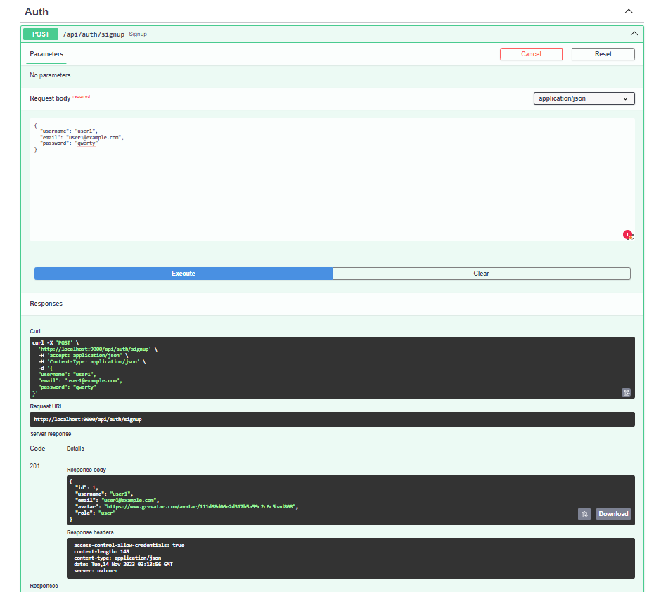

### Login user OAuth2
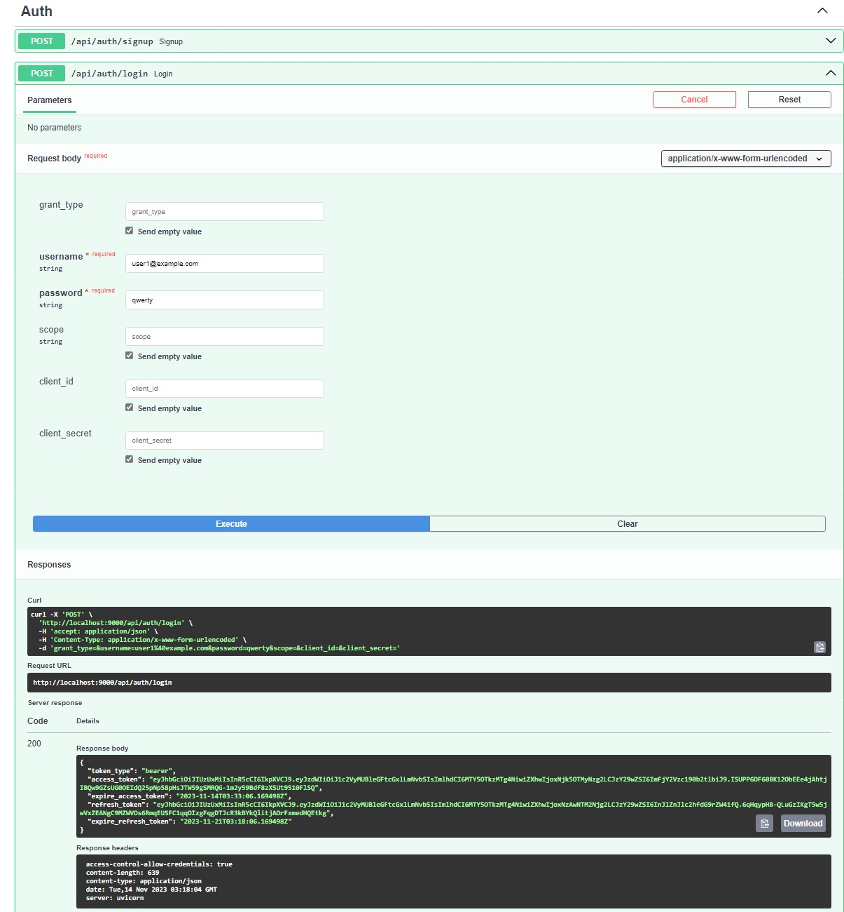

### Access by token JWT
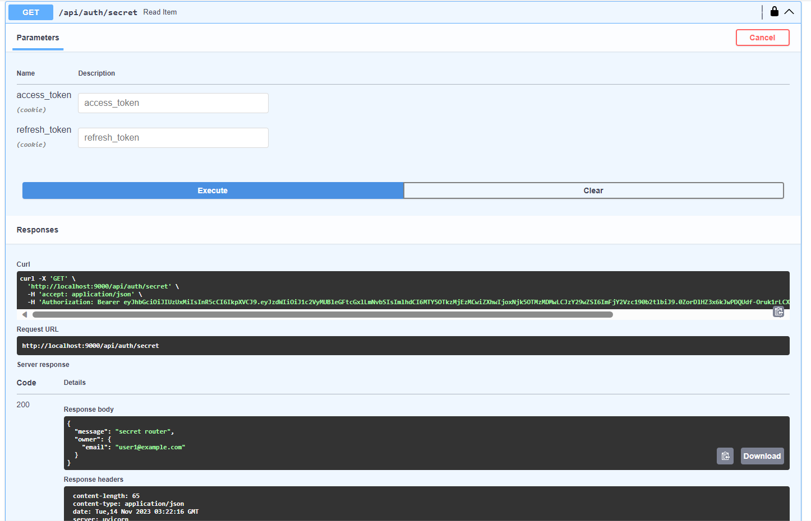

## Механізм авторизації за допомогою JWT токенів, щоб усі операції з контактами проводилися тільки зареєстрованими користувачами

### Access for contacts required
 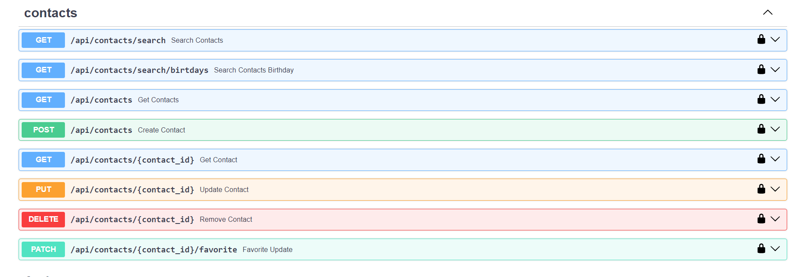

## Користувач має доступ тільки до своїх операцій з контактами

### Create contact of logged user

### Login with user user1@example.com
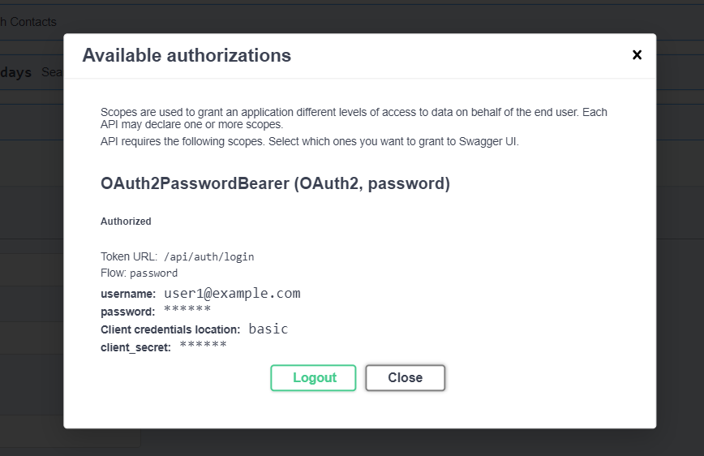

### Get contacts of user user1@example.com only
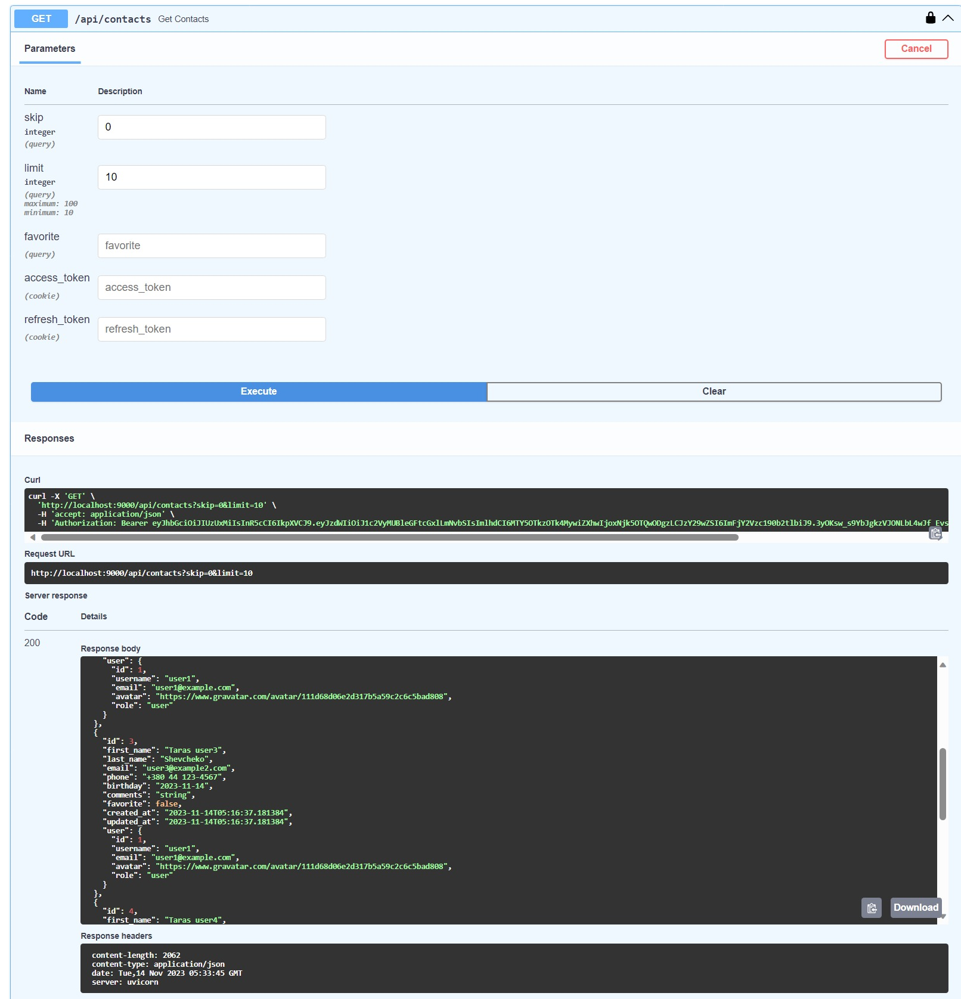

### Login with user user2@example.com
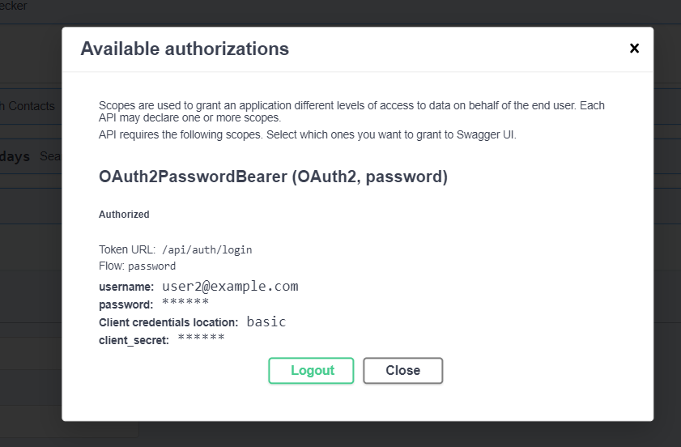

### Get contacts of  user user2@example.com only

## Bonus Static + Template WWW + JavaScript + CSS 
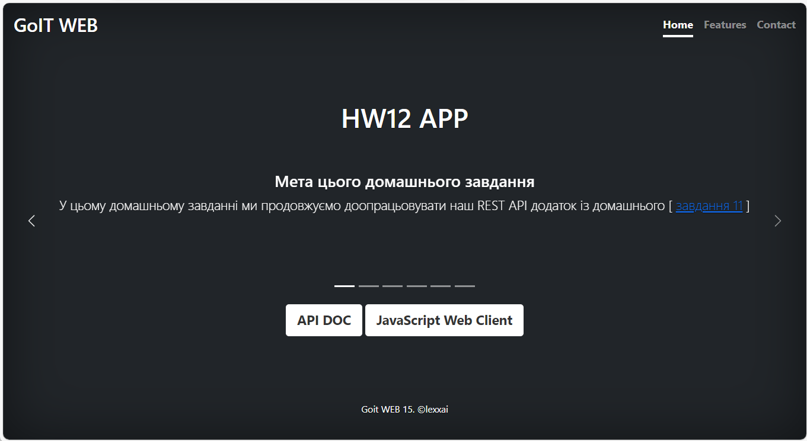

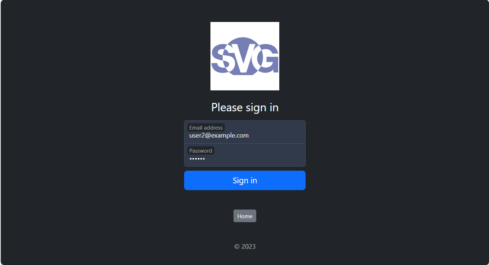

### JavaScript web client for auth and list
#### Get contacts of  user user2@example.com only
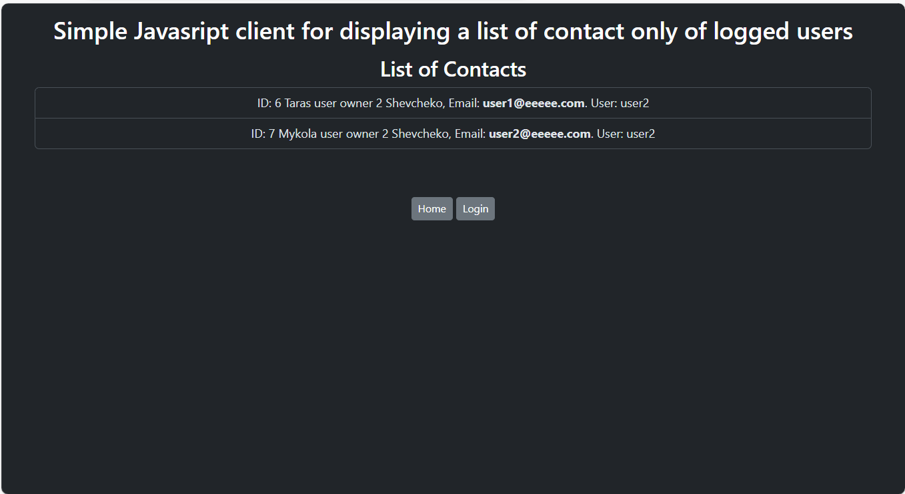
#### Get contacts of  user user1@example.com only
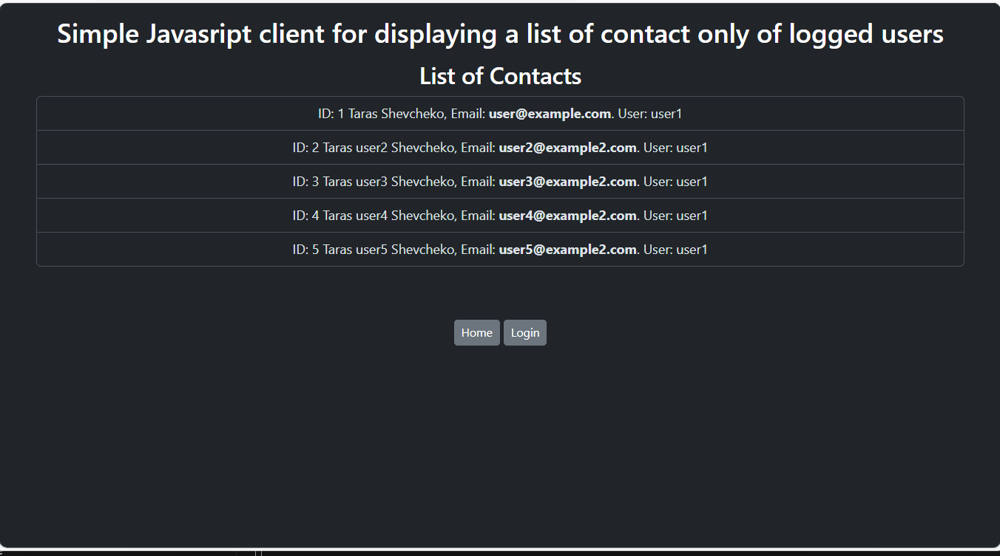

## DOCKER

https://hub.docker.com/r/lexxai/web_hw12
